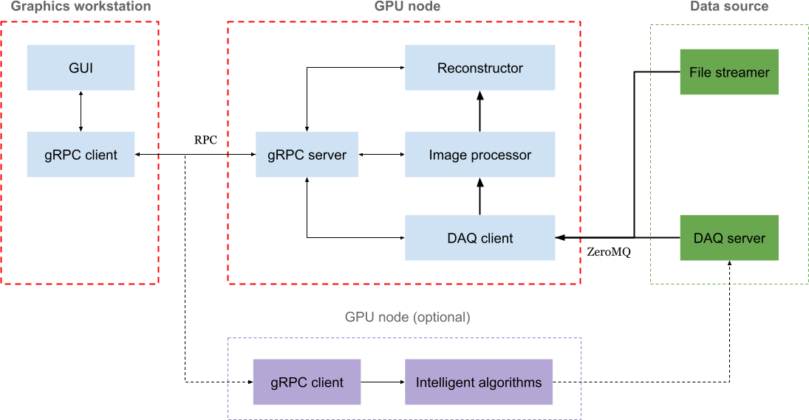

# RECAST-X

**REC**onstruction of **A**rbitrary **S**lices in **T**omography - **X**

**Authors**: Jun Zhu <zhujun981661@gmail.com>

---

This project has been developed based on a successful proof-of-principle test [1] 
using [RECAST3D](https://github.com/cicwi/RECAST3D.git) in 2019 at the 
[TOMCAT](https://www.psi.ch/en/sls/tomcat), [Swiss Light Source](https://www.psi.ch/en/sls). 
It aims at providing a near real-time streaming data analysis and visualization 
tool to allow monitoring [tomoscopy](https://doi.org/10.1002/adma.202104659) 
experiments effectively. It also serves as the foundation of building a smart 
data acquisition system which has the potential to reduce the recorded data size 
by removing trivial or repetitive data while preserving the important scientific 
information which could lead to scientific discoveries.

Besides various new features, the performance of the reconstruction pipeline has 
been heavily optimized and it currently reaches more than 2 GB/s on a ordinary GPU 
node. In addition, a modern GUI has been developed to offer better visualization 
of the data and more flexible control of the reconstruction pipeline.

Currently, the software is dedicated for the DAQ interface at the TOMCAT beamline. 
However, there is a plan to make it more flexible in order to work with other DAQ 
interfaces.

*References*

[1] Buurlage, JW., Marone, F., Pelt, D.M. et al. Real-time reconstruction and visualisation towards dynamic feedback control during time-resolved tomography experiments at TOMCAT. Sci Rep 9, 18379 (2019). https://doi.org/10.1038/s41598-019-54647-4

## Installation

A modern C++ compiler supporting C++17 is required.

```sh
module load gcc/11.3.0
```

### Installing the reconstruction server


On the GPU node `x02da-gpu-1`

```sh
cd /afs/psi.ch/project/TOMCAT_dev/recastx
git clone --recursive <repo>

conda env create -f environment-recon.yml
conda activate recastx-recon

mkdir build && cd build
cmake .. -DCMAKE_PREFIX_PATH=${CONDA_PREFIX:-"$(dirname $(which conda))/../"} \
         -DBUILD_TEST=ON 
make -j12 && make install
```

### Installing the GUI

On the graphics workstation `x02da-gws-3`

```sh
cd /afs/psi.ch/project/TOMCAT_dev/recastx
git clone --recursive <repo>

conda env create -f environment-gui.yml
conda activate recastx-gui

mkdir build-gui && cd build-gui
cmake .. -DCMAKE_PREFIX_PATH=${CONDA_PREFIX:-"$(dirname $(which conda))/../"} \
         -DBUILD_GUI=ON -DBUILD_TEST=ON 
make -j12 && make install
```

## Usage



### At TOMCAT

#### Step 1: Start the GUI 

Log in (no ssh) onto the graphics workstation `x02da-gws-3` and open a terminal
```sh
conda activate recastx-gui
recastx-gui --recon-host x02da-gpu-1
```

Or on the Ra cluster, you can only run the OpenGL GUI inside a [NoMachine](https://www.psi.ch/en/photon-science-data-services/remote-interactive-access
) client by
```sh
vglrun recastx-gui --recon-host x02da-gpu-1
```
**Note**: there is still a problem of linking the OpenGL GUI on Ra.

Or on a local PC
```sh
ssh -L 9971:localhost:9971 x02da-gpu-1
```

#### Step 2: Start the reconstruction server

```sh
conda activate recastx-recon

# Receiving the data stream and running the GUI both locally
recastx-recon  --rows 800 --cols 384 --angles 400

# Receiving the data stream from a DAQ node
recastx-recon --daq-host xbl-daq-36 --rows 800 --cols 384 --angles 400
```

For more information, type
```sh
recastx-recon -h
```

#### Step 3: Stream the data

**Option1**: Streaming data from files on the GPU node

Install [foamstream](https://github.com/zhujun98/foamstream.git), and stream real 
experimental data, for example, by
```sh
foamstream-tomcat --datafile pet1 --ordered

# pet1: recastx-recon --rows 800 --cols 384 --angles 400 --threads 32
# h1: recastx-recon --rows 2016 --cols 288 --angles 500 --threads 32

```
or stream fake data, for example, by
```sh
foamstream-tomcat --rows 800 --cols 384 --projections 10000
```

**Option2**: On the DAQ node

Start data acquisition with GigaFRoST camera.

### At other facilities

TBD: a data adaptor should be needed

## GUI

**Control panel**

- *Acquire*: Click to only start acquiring the raw projection images and meta data.
- *Process*: Click to start acquiring and processing data.
- *Stop*: Click to stop acquiring and processing data.


- *Mode*
  - *Continuous*: Reconstruction takes place continuously at a given interval.
  - *Discrete*: Reconstruction takes place only after a 180-degree-scan finished.
- *Update interval*: Reconstruction in the *Continuous* mode will take place each time after receiving the specified number of projections.


- *Fix camera*: Check to disable rotating and zooming the 3D model with mouse.


- *Downsampling*
    - *Col*: Downsampling factor of columns of the raw projection image.
    - *Row*: Downsampling factor of rows of the raw projection image.
- *Ramp filter*: Select the ramp filter applied before FBP reconstruction.


- *Colormap*: Select the displayed colormap.
- *Auto Levels*: Check to enable automatically setting color levels of the displayed objects.
    - *Min*: Minimum colormap value.
    - *Max*: Maximum colormap value.
- *Slices*
  - *Y-Z*: Toggle the visibility of the slice in the y-z plane.
  - *X-Z*: Toggle the visibility of the slice in the x-z plane.
  - *X-Y*: Toggle the visibility of the slice in the x-y plane.
  - *Reset*: Click to reset the positions and orientations of all the slices.

**Manipulating 3D model with mouse and keyboard:**

- *Hold down the left mouse button and move*: 
    - When a high-resolution slice is selected (the selected slice will be highlighted), the slice will move 
      along its normal direction.
    - Otherwise, the model will rotate along an axis which is perpendicular to the moving direction.
- *Hold down the right mouse button and move*:
    - When a high-resolution slice is selected (the selected slice will be highlighted), the slice will rotate 
      around a highlighted axis.
    - Otherwise, the model will rotate along an axis which is perpendicular to the moving direction.
- *Scroll the mouse*: Zoom in/out of the model.
- <kbd>w</kbd>/<kbd>s</kbd>: Rotate around the x-axis.
- <kbd>a</kbd>/<kbd>d</kbd>: Rotate around the y-axis.
- <kbd>space</kbd>: Reset to perspective view.