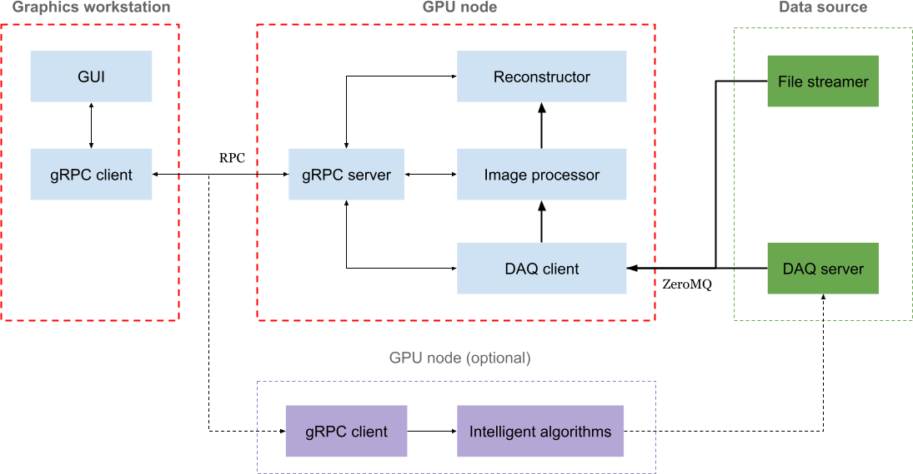

## Step 1: Starting the reconstruction server

```sh
conda activate recastx-recon
```

For a local data source:
```sh
recastx-recon  --rows 800 --cols 384 --angles 400
```

For a remote data source (e.g. DAQ node):
```sh
recastx-recon --rows 800 --cols 384 --angles 400 --daq-host <hostname> 
```

For more information, type
```sh
recastx-recon -h
```

## Step 2: Starting the GUI

```sh
conda activate recastx-gui
```

You can specify the reconstruction server
```sh
recastx-gui --recon-host <hostname>
```

or make use of local port forwarding
```sh
ssh -L 9971:localhost:9971 <hostname>
recastx-gui
```

You can also start the GUI on a node with [NoMachine](https://www.psi.ch/en/photon-science-data-services/remote-interactive-access
) installed
```sh
vglrun recastx-gui --recon-host <hostname>
```

## Step 3: Streaming the data

### Option 1: streaming data from an area detector

Contact the corresponding specialists at the facility.

### Option 2: streaming data from files

We recommend using [foamstream](https://github.com/zhujun98/foamstream.git).
```sh
pip install foamstream

foamstream-tomcat --datafile pet1
```

Please feel free to use your own file streamer as long as the [data protocol](./data_protocol.md) is compatible.
